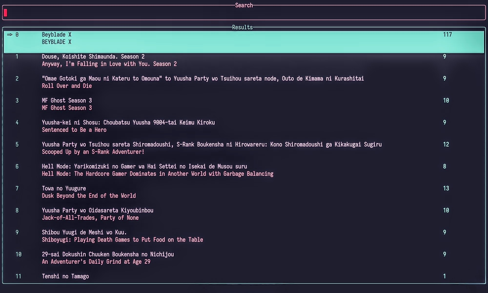

<div id="top">
    <div align="center">
        <h1>Shio</h1>
        <p>inspired by <a href="https://github.com/pystardust/ani-cli">ani-cli from pystardust</a></p>
        <p>
            
            <a href="https://www.blazingly.fast">
                
            </a>
            <a href="https://github.com/Scapy47/Shio/actions/workflows/release.yaml">
                
            </a>
        </p>
    </div>
</div>

   

## Quick Links

- [intro](#Introduction)
- [Getting started](#Getting-started)

## Introduction

**Shio** is a blazingly fast command-line TUI anime search and browser application. that allows you to discover, browse, and watch anime directly from your terminal — no browser required.

### Features

- 🔍 Search for anime instantly
- 📺 Browse titles through an interactive TUI
- ▶️ Stream and watch episodes from the command line
- 🎬 Supports any video player with a command-line interface (CLI)
- ⚡ Fast, lightweight, and keyboard-driven experience


Built for those who want a seamless experience without ever leaving the terminal.

## Getting Started

### Setup Player

Shio uses the `SHIO_PLAYER_CMD` environment variable to launch your media player. Set it to your player of choice — **mpv** and **VLC** are recommended.

**mpv**
```sh
export SHIO_PLAYER_CMD="mpv --user-agent='{user_agent}' --http-header-fields='Referer: {referer}' '{url}'"
```

**VLC**
```sh
export SHIO_PLAYER_CMD="vlc --http-user-agent='{user_agent}' --http-referrer='{referer}' '{url}'"
```

> [!NOTE]
> `{url}` is required. `{user_agent}` and `{referer}` are only required for some hosts — but it's recommended to include them so all sources work correctly.

### Installation

**Linux / macOS**
```sh
curl -fsSL https://raw.githubusercontent.com/Scapy47/Shio/refs/heads/main/etc/setup.sh | sh
```

**Windows**
```powershell
irm https://raw.githubusercontent.com/Scapy47/Shio/refs/heads/main/etc/setup.ps1 | iex
```
